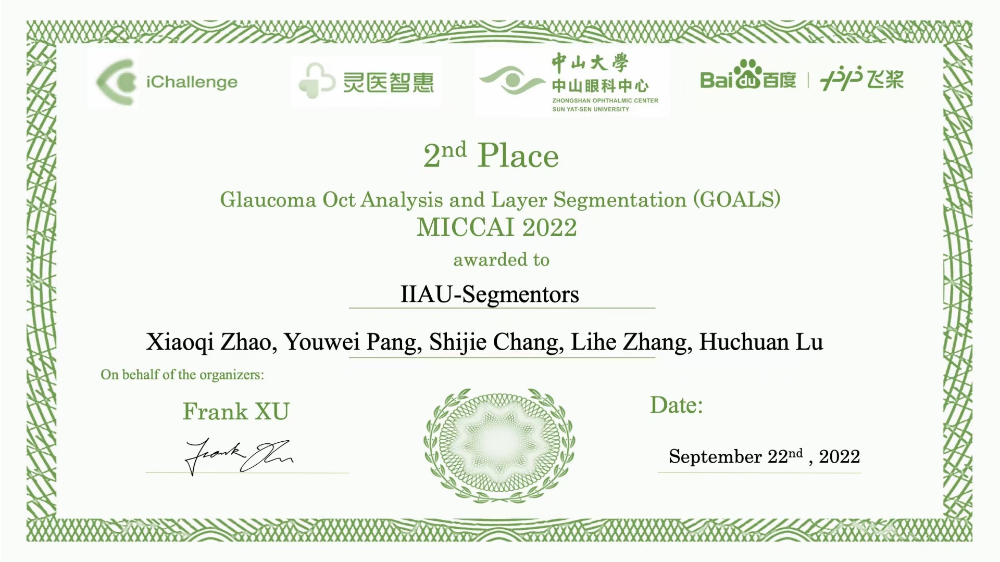
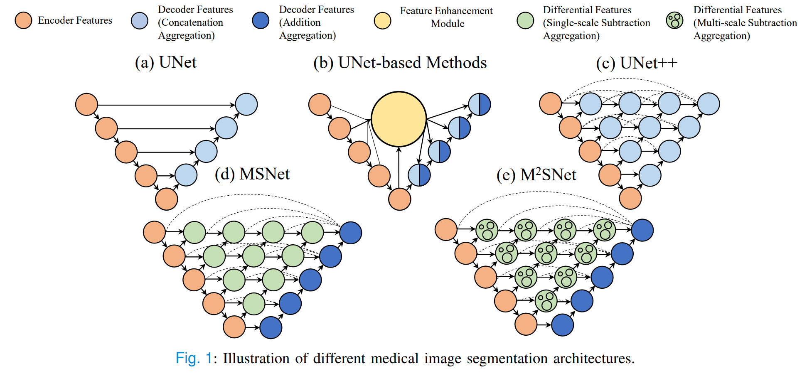
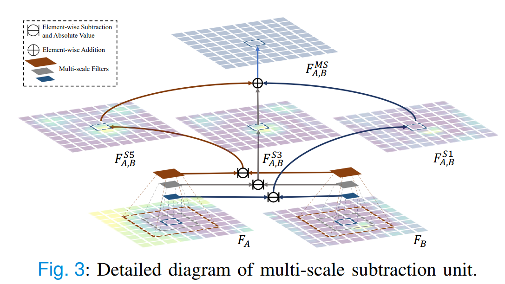
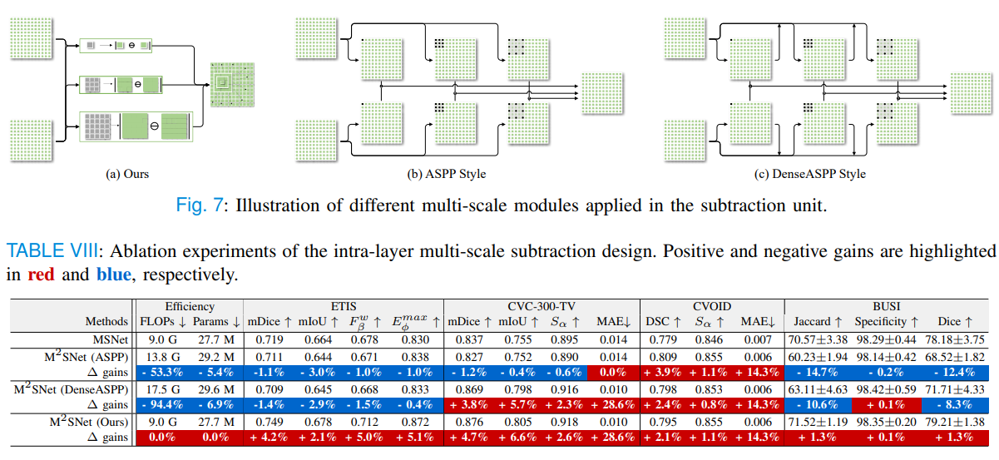
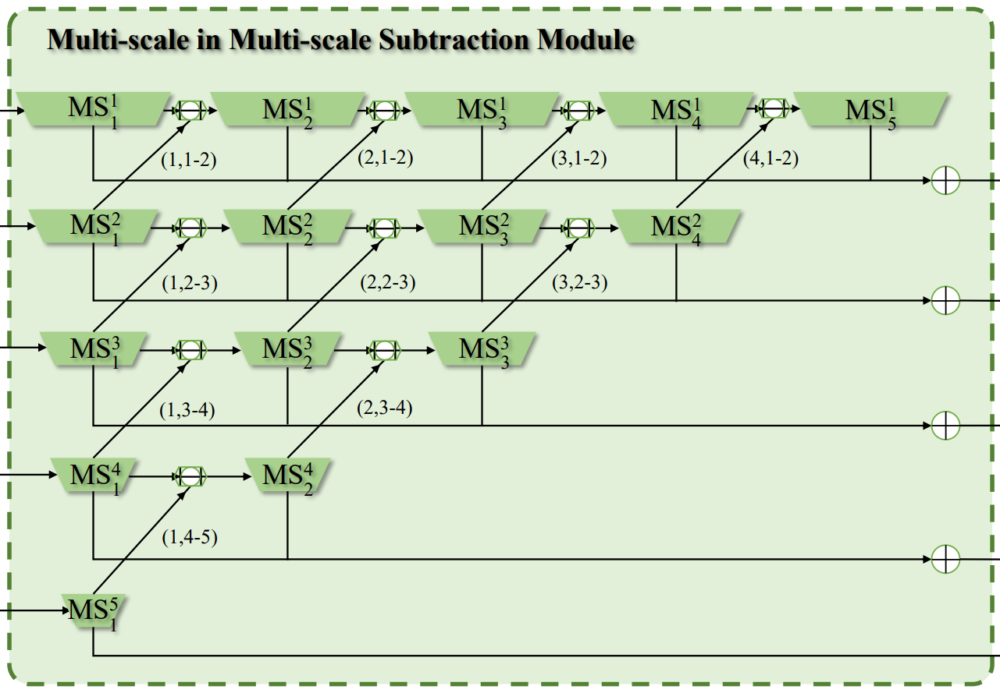
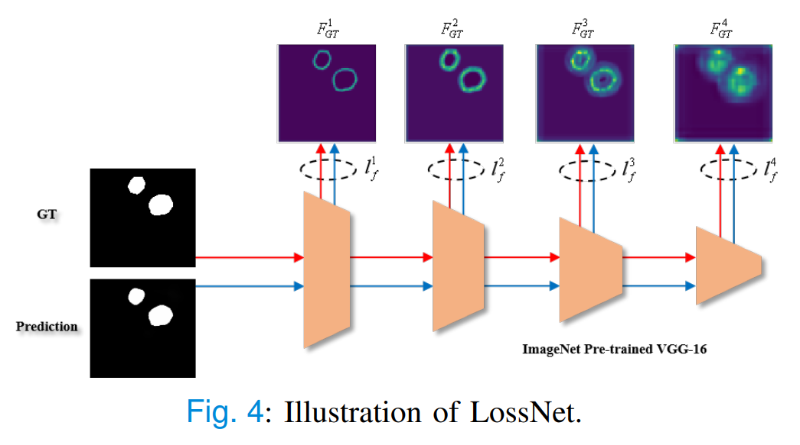
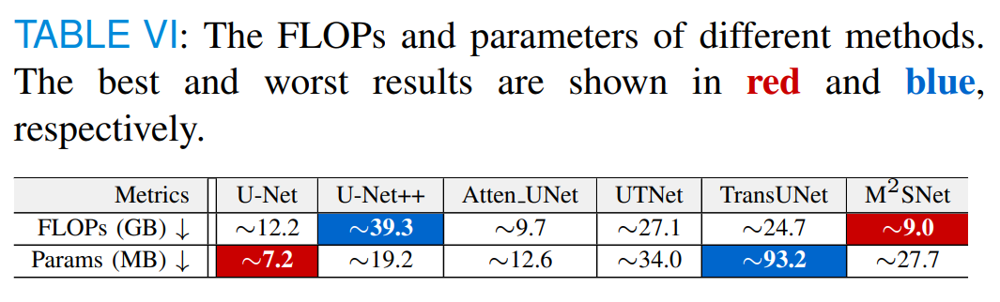

# MSNet&M2SNet
<p align="center">

  


  <h3 align="center">MSNet: Automatic Polyp Segmentation via Multi-scale Subtraction Network</h3>

  <p align="center">
    Xiaoqi Zhao, Lihe Zhang, Huchuan Lu
    <br />
    <a href="https://arxiv.org/pdf/2108.05082.pdf"><strong>⭐ arXiv »</strong></a>
    <br /> 
  </p>
  
  <h3 align="center">M2SNet: Multi-scale in Multi-scale Subtraction Network for Medical Image Segmentation</h3>
  <p align="center">
    Xiaoqi Zhao, Hongpeng Jia, Youwei Pang, Long Lv, Feng Tian, Lihe Zhang, Weibing Sun, Huchuan Lu
    <br />
    <a href="https://arxiv.org/pdf/2303.10894.pdf"><strong>⭐ arXiv »</strong></a>
    <br /> 
  </p>
</p>

<p align="center">
     <br />
</p>

- Official repository of "_**Automatic Polyp Segmentation via Multi-scale Subtraction Network**_" MICCAI-2021. 
- Official repository of "_**M2SNet: Multi-scale in Multi-scale Subtraction Network for Medical Image Segmentation**_".
- :boom: We won the second place (2/100) in the _**[MICCAI 2022 Challenge: Glaucoma Oct Analysis and Layer Segmentation (GOALS)](https://aistudio.baidu.com/aistudio/competition/detail/230/0/leaderboard)**_.
## Datasets  
-  **Image Polyp Segmentation**: (training dataset) [Google Drive](https://drive.google.com/file/d/1lODorfB33jbd-im-qrtUgWnZXxB94F55/view) / [BaiduYunPan(342v)](https://pan.baidu.com/s/17F_n2Mx18osW44vIdYdu1g); (testing dataset) [Google Drive](https://drive.google.com/file/d/1o8OfBvYE6K-EpDyvzsmMPndnUMwb540R/view) / [BaiduYunPan(4e10)](https://pan.baidu.com/s/1uu44ryvB42uzZRBxnf8-WA)  
-  **Video Polyp Segmentation**:  (training dataset) [Google Drive](https://drive.google.com/file/d/1GjYKjyIrQciyii09GEwyLbck2DauV_rw/view?usp=sharing) / [BaiduYunPan(4b45)](https://pan.baidu.com/s/1ewPnV38Kd9XVSMd1F8f9Vw); (testing dataset) [Google Drive](https://drive.google.com/file/d/1jjZKBcb1zlRn-TgBaxQ8mjoQj8LG8z4p/view?usp=sharing) / [BaiduYunPan(ki4a)](https://pan.baidu.com/s/1cLUZ9Vp7vx5vaLP8M27Zdw)  
-  **COVID-19 Lung Infection**:  (training dataset) [Google Drive](https://drive.google.com/file/d/1FHx0Cqkq9iYjEMN3Ldm9FnZ4Vr1u3p-j/view?usp=sharing) / [BaiduYunPan(uoiy)](https://pan.baidu.com/s/1C5MyJV6olEvHfP33O298YQ); (testing dataset) [Google Drive](https://drive.google.com/file/d/1ufi73f_rhq15DElN_gJTO1tTFtUmqDsB/view?usp=sharing) / [BaiduYunPan(r867)](https://pan.baidu.com/s/1yCPLB-LbQoyPUJxrVbF-Yg)  
-  **Breast Ultrasound Segmentation**:  [Google Drive](https://drive.google.com/file/d/1t3cyyTbA0mikL8L2rWRtREdWTLfmA3qL/view?usp=sharing) / [BaiduYunPan(409p)](https://pan.baidu.com/s/1AjiTQetB-xdp-d8pAnAPeg) 
## Results  
-  MSNet: [Google Drive](https://drive.google.com/file/d/1G3-lqyz4dfX7h8DVMrCpArGfqLq9Xc0q/view?usp=sharing) / [BaiduYunPan(j3i8)](https://pan.baidu.com/s/1Ntqk83v9a4hDla35xFXF-A) 
-  M2SNet: [Google Drive](https://drive.google.com/file/d/15OSZ2p3_QLALGdlsHqm9YfZC8dyaEk_2/view?usp=sharing) / [BaiduYunPan(a60m)](https://pan.baidu.com/s/1xiF13F_rpyZF6go-2c3w1w) 
## Trained Model
-  You can download the trained MSNet model at [Google Drive](https://drive.google.com/file/d/1A3lt0sE4lGxd-UJfpFVWt9k2mRTX1CZN/view?usp=sharing) / [BaiduYunPan(ps6e)](https://pan.baidu.com/s/1QomEfwmwCGRcRgDvVxmjAA).  
-  You can download the trained M2SNet model at [Google Drive](https://drive.google.com/file/d/16_O16md68HDNac2PJLzQKXLMXgAk12je/view?usp=sharing) / [BaiduYunPan(5vo3)](https://pan.baidu.com/s/1hZ7QJXWWFYK2KYAqZNvOaw).
-  You can download Res2Net weights at [Google Drive](https://drive.google.com/file/d/1_1N-cx1UpRQo7Ybsjno1PAg4KE1T9e5J/view) / [BaiduYunPan(w46l)](https://pan.baidu.com/s/1kylcEeW03bFGUEkt7362tw)

## Highlight
### Novel Segmentation Architectures
<p align="center">
     <br />
</p>  

### Efficient Intra-Layer Multi-scale Subtraction Design
<p align="center">
     <br />
</p>
<p align="center">
     <br />
</p>

### Efficient Inter-Layer Multi-scale Subtraction Structure
<p align="center">
     <br />
</p>

### Training-free Loss Network
<p align="center">
     <br />
</p>

### Low FLOPs (comparisons under the Res2Net-50 backbone)
<p align="center">
     <br />
</p>

## Prerequisites
- [Python 3.7](https://www.python.org/)
- [Pytorch 1.8.1](http://pytorch.org/)
- [OpenCV 4.6](https://opencv.org/)
- [Numpy 1.19](https://numpy.org/)
- [Apex](https://github.com/NVIDIA/apex)

## Training/Inference/Testing
- set the cfg in train.py: 
``` 
    Dataset.Config(datapath='', savepath='', mode='train', batch=16, lr=0.05, momen=0.9, decay=5e-4, epoch='')
    %the number of training epochs settings in the polyp segmentation, COVID-19 Lung Infection, breast tumor segmentation and OCT layer segmentation are 50, 200, 100         and 100, respectively.
    python train.py
```
- Run prediction_rgb.py (can generate the predicted maps)
- Run test_score.py (support 10 binary segmentation evaluation metrics: MAE, maxF, avgF, wfm, Sm, Em, M_dice, M_iou, Ber,  Acc)

## TODO LIST
- [ ] 3D verison MSNet training.

- [ ] Support different backbones (VGGNet, MobileNet, ResNet, Swin, etc.).

- [ ] Diverse Medical Image Segmentation
  - [x] Polyp
  - [x] COVID-19 Lung Infection
  - [x] Breast tumor
  - [x] OCT Layer
  - [ ] Prostate
  - [ ] Cell Nuclei
  - [ ] Liver
  - [ ] Retinal Vessel
  - [ ] Skin Lesion
  - [ ] Lung 
  - [ ] Pancreas
  - [ ] Hippocampus
  - [ ] Heart
  - [ ] BrainTumour


## BibTex
```
@inproceedings{MSNet,
  title={Automatic polyp segmentation via multi-scale subtraction network},
  author={Zhao, Xiaoqi and Zhang, Lihe and Lu, Huchuan},
  booktitle={MICCAI},
  pages={120--130},
  year={2021},
  organization={Springer}
}
```
```
@article{M2SNet,
  title={M $\^{}$\{$2$\}$ $ SNet: Multi-scale in Multi-scale Subtraction Network for Medical Image Segmentation},
  author={Zhao, Xiaoqi and Jia, Hongpeng and Pang, Youwei and Lv, Long and Tian, Feng and Zhang, Lihe and Sun, Weibing and Lu, Huchuan},
  journal={arXiv preprint arXiv:2303.10894},
  year={2023}
}
```
